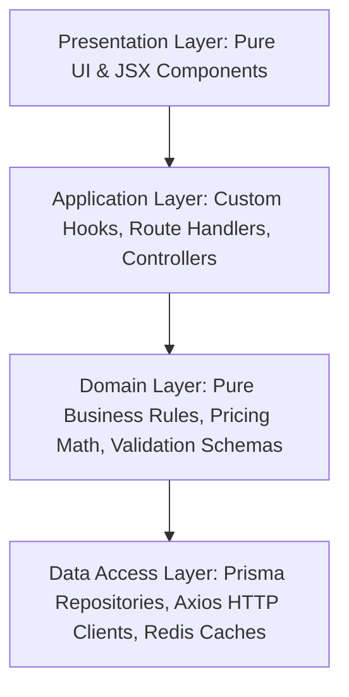

# Full-Stack E-Commerce Architecture Standard

This skill establishes the foundational architecture standards for the VELOUR e-commerce ecosystem across frontend (`ecommerce`) and backend (`ecommerce-BE`). As a 10-year veteran Full-Stack Principal Architect, enforce these guidelines without exception.

---

## 1. The 250-Line Hard Ceiling Rule

> [!IMPORTANT]
> **Strict Maximum Limit**: No source file (`.ts`, `.tsx`, `.js`, `.mjs`) may exceed **250 lines of code** (including imports, types, comments, and whitespace). If a file exceeds or approaches 250 lines, it is an architectural violation and must immediately be decomposed.

### Refactoring Patterns for Files Exceeding 250 LOC:

1. **Monolithic NestJS Services (e.g., `orders.service.ts`, `auth.service.ts`)**:
   - Extract distinct domain sub-services:
     - `orders.service.ts` (Orchestration & Facade) `< 180 lines`
     - `order-pricing.service.ts` (Discounts, Shipping, Tax math) `< 150 lines`
     - `order-stock.service.ts` (Inventory reservation & movements) `< 140 lines`
     - `order-notification.service.ts` (Emails, SMS, Webhooks) `< 100 lines`
     - `order.repository.ts` (Prisma queries, select projections) `< 160 lines`
2. **Monolithic React Components & Pages (e.g., `app/checkout/page.tsx`)**:
   - Extract page logic to container/presenter modules:
     - `CheckoutContainer.tsx` (Route composition & layout wrapper) `< 80 lines`
     - `CheckoutShippingForm.tsx` (Address inputs & validation) `< 120 lines`
     - `CheckoutPaymentForm.tsx` (Payment inputs & tokenization) `< 140 lines`
     - `CheckoutOrderSummary.tsx` (Itemized breakdown & coupon box) `< 110 lines`
     - `useCheckoutForm.ts` (React Hook for state & validation) `< 150 lines`
3. **Monolithic Global State Stores (e.g., `lib/store.tsx`)**:
   - Decompose into domain-isolated slices or stores:
     - `modules/cart/store/useCartStore.ts` `< 140 lines`
     - `modules/auth/store/useAuthStore.ts` `< 130 lines`
     - `modules/wishlist/store/useWishlistStore.ts` `< 90 lines`
     - `modules/ui/store/useModalStore.ts` `< 70 lines`

---

## 2. Domain-Driven Bounded Contexts

Both frontend and backend are divided into explicit, high-cohesion domain modules:

| Bounded Context | Frontend Module (`src/modules/*`) | Backend Module (`src/*`) | Domain Responsibilities |
| :--- | :--- | :--- | :--- |
| **Catalog & Products** | `modules/products/` | `src/products/`, `src/categories/` | Product browsing, variants, sizes, search, filtering, sizing guides |
| **Orders & Checkout** | `modules/checkout/`, `modules/orders/` | `src/orders/` | Multi-step checkout, tax/shipping calculation, order status, returns |
| **Cart & Wishlist** | `modules/cart/`, `modules/wishlist/` | `src/cart/`, `src/wishlist/` | Persistent cart, guest-to-user merging, coupon application |
| **Identity & Security** | `modules/auth/`, `modules/account/` | `src/auth/`, `src/account/`, `src/otp/` | Argon2id auth, TOTP 2FA, session cookies, address book, security profiles |
| **Inventory & Logistics** | `modules/admin/inventory/` | `src/inventory/` | Stock tracking, warehouse locations, stock movements, low-stock alerts |
| **Reviews & Feedback** | `modules/reviews/` | `src/reviews/` | Customer ratings, verified purchase reviews, fit feedback |
| **Marketing & Promotions**| `modules/promotions/` | `src/coupons/`, `src/settings/` | Coupon validation, brand settings, announcement bars |

### Inter-Module Boundaries:
- **No Circular Imports**: Module A cannot import from Module B if Module B imports from Module A.
- **Explicit Public APIs**: Modules must expose their public surface via `index.ts`. Private helpers, sub-components, and internal utilities must not be imported across module boundaries.
- **DTO Immutability**: Data passed between layers must be validated and treated as immutable objects.

---

## 3. Strict Separation of Concerns (SoC)

Every feature implementation must conform to the 4-tier layer boundary:



### Layer Rules:
1. **Presentation Layer (`components/`)**:
   - Zero side-effects, direct API calls, or state mutation logic.
   - Receives data and callbacks via typed props.
   - Max 150 lines per component.
2. **Application / State Layer (`hooks/`, `controllers/`, `stores/`)**:
   - Orchestrates flow of data between UI and Domain/Data layers.
   - Handles async states (`isLoading`, `isError`, `data`).
3. **Domain Layer (`services/`, `domain/`, `utils/`)**:
   - Framework-agnostic pure TypeScript functions wherever possible.
   - Computes discounts, price rounding, stock availability, and authorization checks.
4. **Data Access Layer (`repositories/`, `services/api.ts`, `prisma/`)**:
   - Direct database queries, transaction management, and remote API communication.
   - Handles network retries, serialization, and database exceptions.

---

## 4. Line Count Verification Script

Before committing or completing any refactor, run this command to detect files violating the 250 LOC ceiling:

```bash
# Check all TypeScript/TSX files for line count violations (> 250 lines)
find src app components lib -type f \( -name "*.ts" -o -name "*.tsx" \) -not -path "*/node_modules/*" -not -path "*/.next/*" -not -path "*/dist/*" | while read -r file; do
  lines=$(wc -l < "$file")
  if [ "$lines" -gt 250 ]; then
    echo "⚠️ LOC VIOLATION ($lines lines): $file"
  fi
done
```

---

## 5. Architectural Review Checklist

When writing or modifying code:
- [ ] Is every file under 250 lines of code?
- [ ] Are concerns cleanly separated across Presentation, Application, Domain, and Data layers?
- [ ] Are module imports clean and directed through domain module boundaries?
- [ ] Are business calculations unit-testable and isolated from UI or HTTP routing?
- [ ] Are error boundaries and loading states properly handled?
