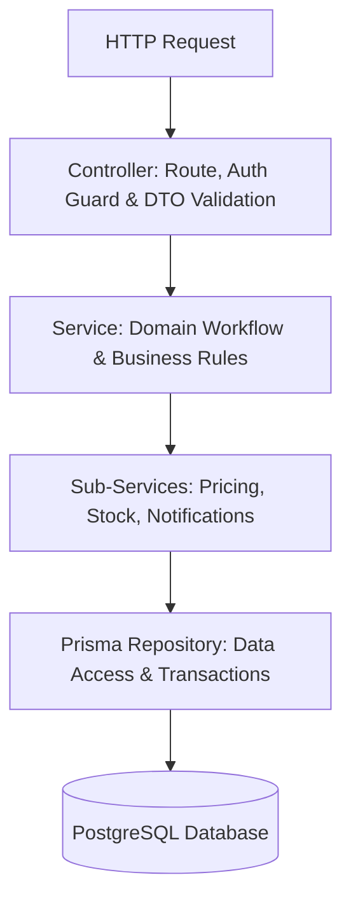

# NestJS Clean Architecture Standard

This skill establishes strict architectural standards for the NestJS 10 backend (`ecommerce-BE`). All backend code must maintain clean layered separation, rigorous DTO validation, and the 250 LOC ceiling.

---

## 1. Layered Responsibilities & Separation



### Layer Rules:
1. **Controllers (`*.controller.ts`) `< 150 lines`**:
   - HTTP routing, status codes, Swagger documentation, and guard attachments only.
   - **Zero Prisma queries, zero business logic branches, zero data transformations.**
   - Every endpoint must have `@ApiOperation`, `@ApiResponse`, and `@ApiTags`.
2. **Services (`*.service.ts`) `< 250 lines`**:
   - Domain logic orchestration, business constraints, calculation algorithms, and transaction boundaries.
   - If a service exceeds 200 lines, decompose it into focused domain sub-services.
3. **DTOs (`dto/*.dto.ts`) `< 150 lines`**:
   - Every input payload must be validated via `class-validator` and transformed via `class-transformer`.
4. **Repositories / Query Services (`*.repository.ts`) `< 200 lines`**:
   - Encapsulate Prisma queries, filtering, sorting, pagination, and projection selection.

---

## 2. Standard Controller Pattern

Controllers must be lean, readable, and strictly delegate execution to services:

```typescript
// src/orders/orders.controller.ts
import { Controller, Post, Get, Body, Param, Query, UseGuards, HttpCode, HttpStatus } from '@nestjs/common';
import { ApiTags, ApiOperation, ApiResponse, ApiBearerAuth } from '@nestjs/swagger';
import { OrdersService } from './orders.service';
import { CheckoutDto } from './dto/checkout.dto';
import { OrderQueryDto } from './dto/order-query.dto';
import { JwtAuthGuard } from '../auth/jwt-auth.guard';
import { CurrentUser, CurrentUserData } from '../common/decorators/current-user.decorator';

@ApiTags('Orders')
@Controller('orders')
export class OrdersController {
  constructor(private readonly ordersService: OrdersService) {}

  @Post('checkout')
  @HttpCode(HttpStatus.CREATED)
  @UseGuards(JwtAuthGuard)
  @ApiBearerAuth()
  @ApiOperation({ summary: 'Process checkout transaction for authenticated customer' })
  @ApiResponse({ status: 201, description: 'Order successfully created and inventory reserved' })
  @ApiResponse({ status: 400, description: 'Invalid stock, expired coupon, or invalid payment' })
  async checkout(
    @Body() dto: CheckoutDto,
    @CurrentUser() user: CurrentUserData,
  ) {
    return this.ordersService.checkout(dto, user.id);
  }

  @Get(':id')
  @UseGuards(JwtAuthGuard)
  @ApiBearerAuth()
  @ApiOperation({ summary: 'Get order details by ID' })
  @ApiResponse({ status: 200, description: 'Order details returned' })
  @ApiResponse({ status: 404, description: 'Order not found' })
  async getOrder(@Param('id') id: string, @CurrentUser() user: CurrentUserData) {
    return this.ordersService.getOrderById(id, user.id, user.role);
  }
}
```

---

## 3. Decomposing Monolithic Services (< 250 LOC)

When a service (like `OrdersService` or `AuthService`) handles multiple workflows, split it into dedicated domain collaborators:

```text
src/orders/
├── orders.controller.ts            # Route handler (< 120 lines)
├── orders.module.ts                # NestJS DI wire-up (< 40 lines)
├── orders.service.ts               # Facade & orchestrator (< 180 lines)
├── services/
│   ├── order-pricing.service.ts    # Discounts, coupons, tax math (< 140 lines)
│   ├── order-stock.service.ts      # Inventory check & stock movements (< 130 lines)
│   └── order-notification.service.ts # Email/SMS dispatch (< 90 lines)
├── repositories/
│   └── order.repository.ts         # Prisma DB operations & transactions (< 160 lines)
└── dto/
    ├── checkout.dto.ts             # Input DTO with class-validator (< 80 lines)
    └── order-response.dto.ts       # Output serialization DTO (< 60 lines)
```

### Example Sub-Service (`OrderPricingService`):

```typescript
// src/orders/services/order-pricing.service.ts
import { Injectable, BadRequestException } from '@nestjs/common';
import { DiscountType, Coupon } from '@prisma/client';
import { PrismaService } from '../../prisma/prisma.service';

@Injectable()
export class OrderPricingService {
  constructor(private readonly prisma: PrismaService) {}

  calculateTotals(items: { price: number; quantity: number }[], coupon?: Coupon | null) {
    const subtotal = items.reduce((sum, item) => sum + item.price * item.quantity, 0);
    let discount = 0;

    if (coupon) {
      if (coupon.minOrderValue && subtotal < Number(coupon.minOrderValue)) {
        throw new BadRequestException(`Minimum order value of $${coupon.minOrderValue} required for coupon ${coupon.code}`);
      }
      if (coupon.discountType === DiscountType.PERCENTAGE) {
        discount = (subtotal * Number(coupon.discountValue)) / 100;
        if (coupon.maxDiscount && discount > Number(coupon.maxDiscount)) {
          discount = Number(coupon.maxDiscount);
        }
      } else {
        discount = Number(coupon.discountValue);
      }
    }

    const shipping = subtotal >= 75 ? 0 : 15;
    const finalTotal = Math.max(0, subtotal - discount + shipping);

    return { subtotal, discount, shipping, total: finalTotal };
  }
}
```

---

## 4. DTO Validation Standards

All incoming requests must be strictly typed and validated using `class-validator` and `class-transformer`:

```typescript
// src/orders/dto/checkout.dto.ts
import { ApiProperty, ApiPropertyOptional } from '@nestjs/swagger';
import { IsString, IsNotEmpty, IsEmail, IsOptional, IsBoolean, ValidateNested } from 'class-validator';
import { Type } from 'class-transformer';

export class ShippingAddressDto {
  @ApiProperty({ example: '742 Evergreen Terrace' })
  @IsString()
  @IsNotEmpty()
  line1: string;

  @ApiPropertyOptional({ example: 'Apt 4B' })
  @IsString()
  @IsOptional()
  line2?: string;

  @ApiProperty({ example: 'New York' })
  @IsString()
  @IsNotEmpty()
  city: string;

  @ApiProperty({ example: 'NY' })
  @IsString()
  @IsNotEmpty()
  state: string;

  @ApiProperty({ example: '10001' })
  @IsString()
  @IsNotEmpty()
  zip: string;
}

export class CheckoutDto {
  @ApiProperty({ type: ShippingAddressDto })
  @ValidateNested()
  @Type(() => ShippingAddressDto)
  shippingAddress: ShippingAddressDto;

  @ApiPropertyOptional({ example: 'SUMMER20' })
  @IsString()
  @IsOptional()
  promoCode?: string;

  @ApiPropertyOptional({ default: false })
  @IsBoolean()
  @IsOptional()
  giftPackaging?: boolean;
}
```

---

## 5. Global Validation Pipe Configuration

Ensure `main.ts` configures `ValidationPipe` with security-hardened options:

```typescript
app.useGlobalPipes(
  new ValidationPipe({
    whitelist: true,              // Strips non-whitelisted properties
    forbidNonWhitelisted: true,   // Rejects requests with unexpected fields
    transform: true,              // Automatically coerces payloads to DTO instances
    transformOptions: {
      enableImplicitConversion: false,
    },
  }),
);
```
