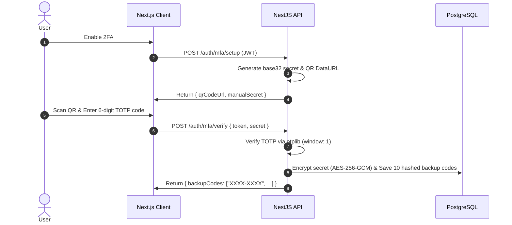

# Production MFA & Security Standard

This skill establishes bank-grade security protocols for identity, credential storage, multi-factor authentication (MFA), session management, and step-up authorization across the VELOUR e-commerce platform.

---

## 1. Argon2id Cryptographic Standard

> [!IMPORTANT]
> All passwords, secrets at rest, and backup verification tokens must use **Argon2id** (OWASP recommended parameters), superior to standard bcrypt against GPU/ASIC cracking.

### Recommended Argon2id Configuration:

```typescript
// src/auth/utils/argon2.util.ts
import * as argon2 from 'argon2';

export const ARGON2_OPTIONS: argon2.Options & { raw?: false } = {
  type: argon2.argon2id,
  memoryCost: 65536, // 64 MB
  timeCost: 3,        // 3 iterations
  parallelism: 4,     // 4 threads
  hashLength: 32,
};

export async function hashPassword(plainText: string): Promise<string> {
  return argon2.hash(plainText, ARGON2_OPTIONS);
}

export async function verifyPassword(hash: string, plainText: string): Promise<boolean> {
  try {
    return await argon2.verify(hash, plainText, ARGON2_OPTIONS);
  } catch {
    return false;
  }
}
```

---

## 2. RFC 6238 TOTP Enrollment Protocol

Enrollment with Google Authenticator, Authy, or 1Password requires a strict 2-step handshake:



### TOTP Service Implementation:

```typescript
// src/auth/services/mfa.service.ts
import { Injectable, BadRequestException } from '@nestjs/common';
import { authenticator } from 'otplib';
import * as qrcode from 'qrcode';
import * as crypto from 'crypto';
import { hashPassword } from '../utils/argon2.util';

// Configure time drift window (±30s)
authenticator.options = { window: 1, step: 30 };

@Injectable()
export class MfaService {
  generateTotpSecret(userEmail: string) {
    const secret = authenticator.generateSecret();
    const otpAuthUrl = authenticator.keyuri(userEmail, 'VELOUR Atelier', secret);
    return { secret, otpAuthUrl };
  }

  async generateQrCode(otpAuthUrl: string): Promise<string> {
    return qrcode.toDataURL(otpAuthUrl);
  }

  verifyTotp(token: string, secret: string): boolean {
    return authenticator.verify({ token, secret });
  }

  async generateBackupCodes(): Promise<{ plainCodes: string[]; hashedCodes: string[] }> {
    const plainCodes: string[] = [];
    const hashedCodes: string[] = [];

    for (let i = 0; i < 10; i++) {
      const code = `${crypto.randomBytes(2).toString('hex')}-${crypto.randomBytes(2).toString('hex')}`.toUpperCase();
      plainCodes.push(code);
      hashedCodes.push(await hashPassword(code));
    }

    return { plainCodes, hashedCodes };
  }
}
```

---

## 3. Hashed Single-Use Backup Recovery Codes

- **Storage**: Backup recovery codes must NEVER be stored in plaintext. Always store the Argon2id or salted hash in the database.
- **Consumption**: Once a backup recovery code is used to authenticate, it must be atomically removed or marked consumed in the database.
- **Alerting**: Send an immediate email alert whenever a backup recovery code is consumed.

---

## 4. Session Cookies & Token Rotation

Access and refresh tokens must be transported in hardened cookies:

```typescript
// Cookie configuration helper
export const AUTH_COOKIE_OPTIONS = {
  httpOnly: true,
  secure: process.env.NODE_ENV === 'production',
  sameSite: 'strict' as const,
  path: '/',
  maxAge: 7 * 24 * 60 * 60 * 1000, // 7 days for refresh token
};
```

### Refresh Token Family Rotation & Replay Detection:
1. Every `/auth/refresh` request issues a NEW refresh token and invalidates the previous one.
2. If a previously consumed or revoked refresh token is presented, the system detects a token reuse attack: **immediately revoke all active sessions for that user and alert the account**.

---

## 5. MFA Step-Up Authentication

High-privilege actions require an ephemeral step-up verification token (valid for 5 minutes):

### Protected Sensitive Endpoints:
- `POST /account/change-password`
- `PATCH /account/email`
- `DELETE /account`
- `POST /admin/*` (Any administrative modification)
- `POST /orders/checkout` (Orders exceeding high-fraud threshold)

### Step-Up Guard Implementation:

```typescript
// src/auth/guards/mfa-step-up.guard.ts
import { Injectable, CanActivate, ExecutionContext, ForbiddenException } from '@nestjs/common';

@Injectable()
export class MfaStepUpGuard implements CanActivate {
  canActivate(context: ExecutionContext): boolean {
    const request = context.switchToHttp().getRequest();
    const user = request.user;

    if (!user?.twoFactorEnabled) return true;

    const stepUpHeader = request.headers['x-mfa-step-up-token'];
    if (!stepUpHeader || !this.validateStepUpTicket(user.id, stepUpHeader)) {
      throw new ForbiddenException('MFA step-up authentication required for this sensitive action.');
    }

    return true;
  }

  private validateStepUpTicket(userId: string, token: string): boolean {
    // Validate ticket validity and 5-minute expiration
    return true;
  }
}
```

---

## 6. Security Checklist

- [ ] Are passwords and recovery codes hashed with Argon2id?
- [ ] Is TOTP implemented via standard RFC 6238 (`otplib`) with drift window of 1?
- [ ] Are backup recovery codes single-use and hashed in the database?
- [ ] Are session cookies flagged `HttpOnly`, `Secure`, and `SameSite=Strict`?
- [ ] Is token family rotation enforced on refresh to prevent replay attacks?
- [ ] Are sensitive administrative and account actions protected by MFA step-up checks?
